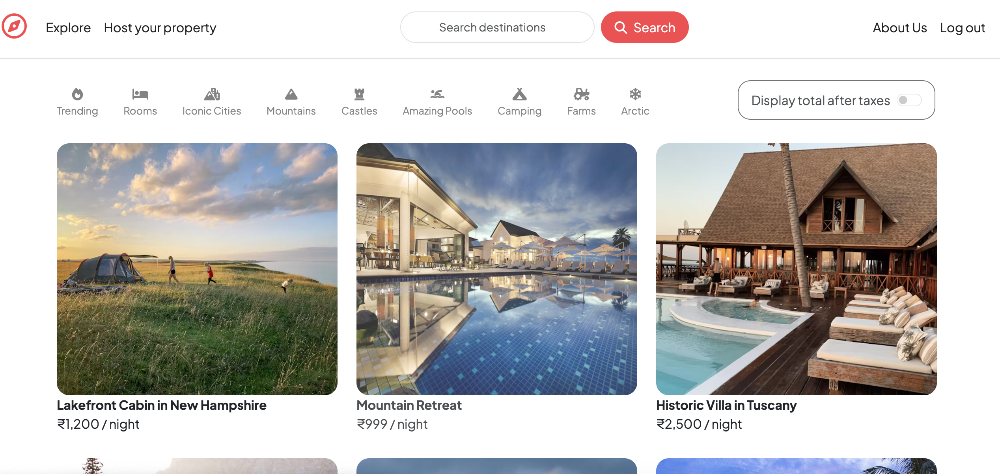
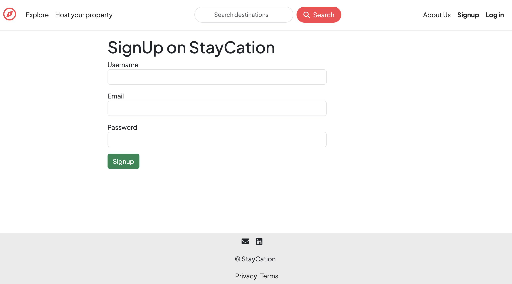
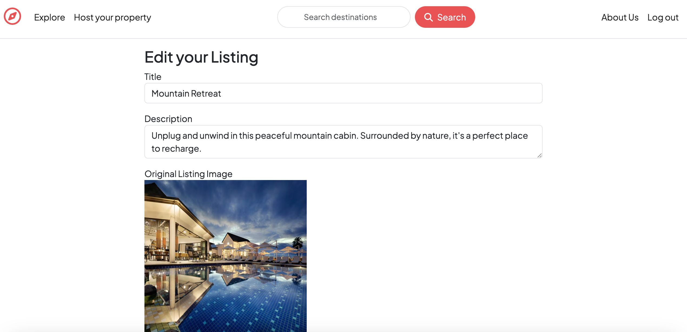
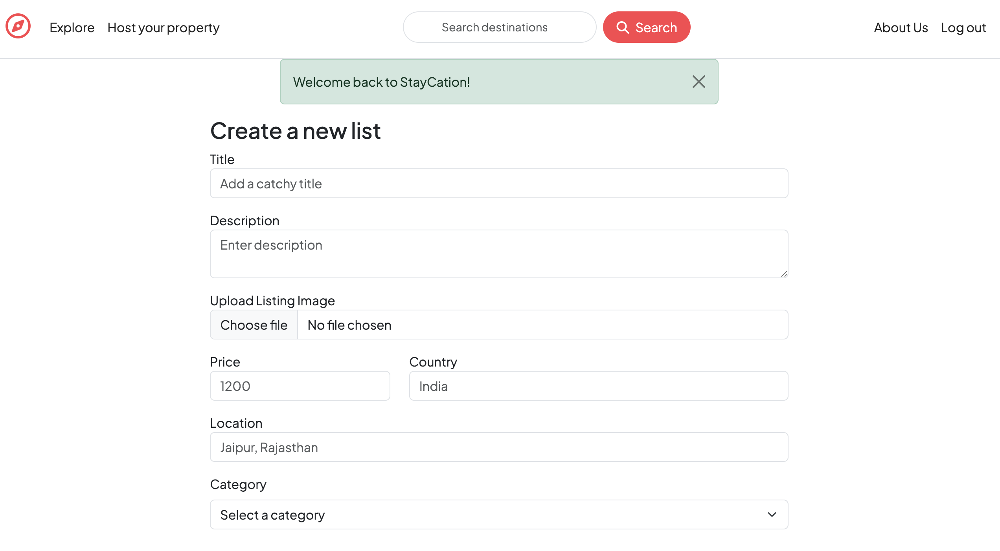
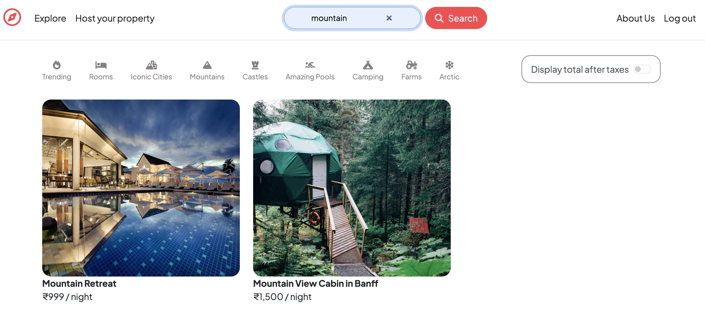
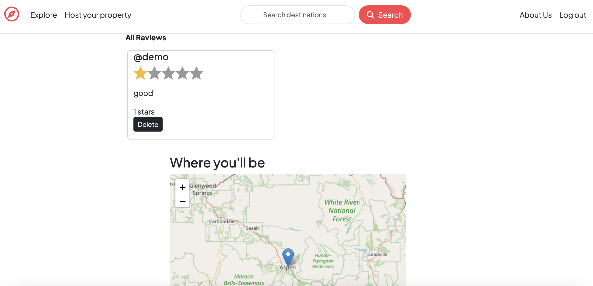

# 🏡 StayCation

[🌐 Live Website](https://staycation-lodgingplatform.onrender.com/)  
A full-stack vacation rental platform where users can explore, list, review, and manage stays with interactive maps.

---

## 🚀 Features

- 🏡 **Listings Management**: Create, read, update, and delete vacation rental listings.
- 🖼️ **Cloud Image Upload**: Upload listing images to Cloudinary via Multer.
- 🧭 **Location Geocoding**: Auto-fetch coordinates for listings using OpenStreetMap (Nominatim API).
- 🌎 **Map Integration**: Interactive map view using **Leaflet.js** and **OpenStreetMap**..
- 👤 **Authentication**: Secure login and signup with `passport-local`.
- ✏️ **Edit/Delete Controls**: Only listing owners can edit or delete their properties.
- 📝 **Review System**: Authenticated users can leave ratings and comments on listings.
- 🧹 **Cascade Delete**: Deleting a listing also deletes its associated reviews.
- 🔍 **Search & Category Filters**: Filter listings by keyword or predefined categories.
- 🧪 **Form Validation**: Client-side & server-side validation for forms.
- 💡 **Flash Messages**: Instant feedback using connect-flash.
- 🌓 **Responsive & Accessible**: Works well across devices with keyboard navigation.

---

## 🛠️ Tech Stack

- **Frontend:** EJS, Bootstrap, HTML/CSS
- **Backend:** Node.js, Express.js
- **Database:** MongoDB Atlas
- **Authentication:** Passport.js with passport-local-mongoose
- **Cloud Storage:** Cloudinary for image uploads
- **Geocoding:** OpenStreetMap Nominatim API
- **Deployment:** Render

---

## 🚀 Getting Started Locally

### 1. Clone the Repo
```bash
git clone https://github.com/megha-2461/staycation.git
cd staycation
```

### 2.  Install Dependencies
```bash
npm install
```

### 3. Environment Variables

Create a `.env` file in the root directory. You can refer to the provided `.env.example` file for the required keys:

```bash
cp .env.example .env
```
### 4. Getting Started

```bash
node app.js
```

### Screenshots
 
 
 
 
 
 


### 🤝 Contributing
Contributions are welcome!  
To contribute to this project:

1. Fork the repository  
2. Create a new branch
3. Commit your changes
4. Push to the branch
5. Open a Pull Request

### 🧾 License
This project is licensed under the MIT License.
Feel free to use, modify, and distribute as per the license terms.

### 👩‍💻 Author

**Megha Goswami**   
💼 GitHub: [@megha-goswami](https://github.com/megha-2461)  
🚀 Deployed Project: [StayCation](https://staycation-lodgingplatform.onrender.com/)
